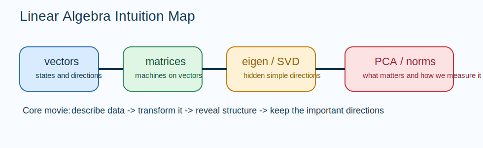

# Linear Algebra Intuition Guide

Linear algebra is the language of structured movement.
It tells you how data is arranged, how transformations act on that data, and which directions matter most.

## The Big Idea

Think of a vector as "a thing with direction and magnitude" and a matrix as "a machine that systematically transforms vectors."
Once you internalize that one sentence, almost the whole section becomes easier:

- vectors describe states, inputs, features, embeddings, gradients, and directions
- matrices describe mixing, rotation, scaling, projection, and linear prediction
- decompositions reveal the hidden structure inside a matrix

## The Mental Model That Makes Everything Click

Use this ladder:

1. A vector is a point, arrow, or list of feature values.
2. A basis is a language for describing that vector.
3. A matrix is a rule that takes one vector and returns another.
4. An eigendirection is a special direction the rule does not turn.
5. A decomposition is a way to rewrite a complicated rule as simpler moves.

If you keep that ladder in your head, the notebooks stop feeling like separate topics and start feeling like one story.

## How The Notebooks Fit Together

- `01_vectors_and_spaces.ipynb`: what a vector really is, and what it means for vectors to live in a space
- `02_matrices_and_operations.ipynb`: how linear transformations are encoded and combined
- `03_matrix_decompositions.ipynb`: how to break a matrix into interpretable pieces
- `04_eigenvalues_eigenvectors.ipynb`: directions that survive a transformation up to scaling
- `05_SVD_complete.ipynb`: the master decomposition for rectangular matrices
- `06_PCA_from_scratch.ipynb`: SVD and eigenideas applied to data compression
- `07_norms_and_distances.ipynb`: how we measure size, error, similarity, and stability

## Intuitionmaxxed Explanations

### Vectors And Spaces

A vector is not just a column of numbers.
It is the same object viewed in one coordinate system.
The numbers are the description, not the thing itself.

### Matrices And Operations

Matrix multiplication is function composition in disguise.
If `A` happens before `B`, then `BAx` means "first transform by `A`, then transform by `B`."
That order matters because transformations usually do not commute.

### Eigenvalues And Eigenvectors

Most directions get rotated and stretched.
Eigenvectors are the rare directions that only get stretched or flipped.
That is why they are so useful: they expose the transformation's natural axes.

### SVD

SVD says every matrix can be understood as:

1. rotate into a convenient coordinate system
2. scale along independent axes
3. rotate again

That is the cleanest intuition in this whole section.
Whenever a matrix feels mysterious, imagine this three-stage movie.

### PCA

PCA asks: "If I am allowed to keep only one direction, which direction preserves the most of the data?"
It does not look for the prettiest line.
It looks for the line along which the data varies the most.

### Norms And Distances

A norm tells you what "large" means.
A distance tells you what "close" means.
Training objectives, regularization, clustering, and numerical stability all depend on that choice.

## Why This Matters In ML

- embeddings are vectors
- layers are matrices
- gradients are vectors in parameter space
- PCA is dimensionality reduction
- norms define penalties and losses
- SVD explains low-rank structure in weights and activations

## Common Traps

- Confusing coordinates with the underlying vector.
- Treating matrix multiplication like elementwise multiplication.
- Memorizing decomposition formulas without remembering what geometric move each factor performs.
- Thinking PCA finds classes. It only finds directions of variance.

## What To Ask Yourself While Studying

- What object is being transformed here?
- What basis am I using to describe it?
- Is this matrix rotating, scaling, projecting, or mixing?
- Which directions stay simple under this transformation?
- What notion of size is the model implicitly using?
