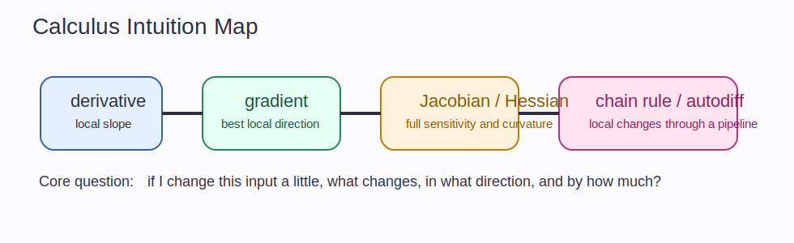

# Calculus Intuition Guide

Calculus is the mathematics of controlled change.
In ML, that really means one thing: if I nudge this input or parameter a little, what changes, in which direction, and by how much?

## The Big Idea

Every notebook in this section is a refinement of the same question:

"How sensitive is the output to a tiny local change?"

Start from that and the rest lines up:

- a derivative is 1D sensitivity
- a gradient is multidimensional sensitivity
- a Jacobian is the full sensitivity map from many inputs to many outputs
- a Hessian is curvature, which tells you how the sensitivity itself changes
- the chain rule tells you how local sensitivities combine through a pipeline

## The Mental Model That Makes Everything Click

Imagine walking on a surface in fog.

- the derivative tells you the local tilt in one direction
- the gradient tells you the steepest uphill direction
- the Hessian tells you whether the terrain is bowl-shaped, saddle-shaped, or flat
- the chain rule tells you how one slope becomes another when the path itself is transformed

This is why calculus is unavoidable in deep learning.
Training is repeated local sensitivity analysis.

## How The Notebooks Fit Together

- `01_limits_and_continuity.ipynb`: when local reasoning is even allowed
- `02_derivatives_single_variable.ipynb`: slope in one dimension
- `03_partial_derivatives.ipynb`: changing one variable while holding others fixed
- `04_gradients_and_directional_derivatives.ipynb`: best local direction and arbitrary directions
- `05_jacobians.ipynb`: all first-order sensitivities at once
- `06_hessians.ipynb`: curvature and second-order behavior
- `07_chain_rule_scalar_to_matrix.ipynb`: how gradients move through composed systems
- `08_matrix_calculus.ipynb`: calculus written in the shapes ML actually uses
- `09_automatic_differentiation.ipynb`: how software automates the chain rule

## Intuitionmaxxed Explanations

### Limits And Continuity

Continuity is the permission slip for local reasoning.
If tiny input changes cause wild output jumps, the local picture is not trustworthy.

### Derivatives

A derivative is not "the formula you get after differentiating."
It is a local linear approximation.
Near a point, a smooth function behaves like a line.

### Partial Derivatives

A partial derivative isolates one knob while freezing the others.
That is useful, but incomplete.
Real ML systems usually move many knobs together.

### Gradient

The gradient is the direction of maximum local increase.
Negative gradient means the fastest local decrease.
That is why optimization algorithms follow it.

### Jacobian

If the function has many outputs, one gradient is not enough.
The Jacobian is the table of how each output responds to each input.

### Hessian

The Hessian tells you whether a slope is getting steeper, flatter, or changing sign.
That is why it encodes curvature and why second-order methods care about it.

### Chain Rule

The chain rule is the plumbing law of ML.
Every layer produces an intermediate quantity.
Backprop works because local derivatives multiply through that computation graph.

## Why This Matters In ML

- gradients drive learning
- Jacobians explain sensitivity and stability
- Hessians explain curvature and conditioning
- matrix calculus is the notation of real model derivations
- autodiff is how modern frameworks perform backprop

## Common Traps

- Treating the derivative as a symbolic ritual instead of a local linear model.
- Forgetting dimensions in Jacobians and matrix calculus.
- Thinking partial derivatives alone explain full multivariate behavior.
- Memorizing the chain rule in scalar form but freezing when tensors appear.

## What To Ask Yourself While Studying

- What is changing?
- What is being held fixed?
- Is this a scalar-to-scalar, vector-to-scalar, or vector-to-vector map?
- What shape should the derivative object have?
- If I compose these steps, where does the chain rule enter?
