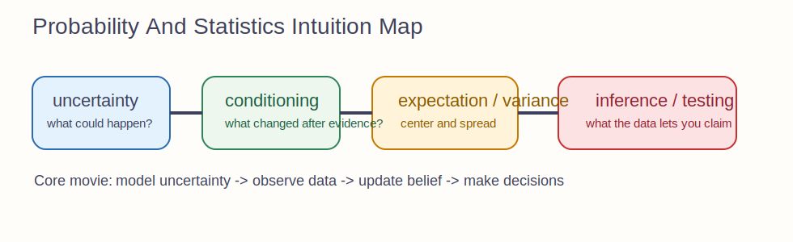

# Probability And Statistics Intuition Guide

Probability is disciplined uncertainty.
Statistics is what you do with that uncertainty once data arrives.

## The Big Idea

Probability answers:
"Before seeing the data, how should I model what could happen?"

Statistics answers:
"After seeing the data, how should I update belief, estimate unknown quantities, and measure confidence?"

This section works best when you treat it as bookkeeping for uncertainty rather than a bag of formulas.

## The Mental Model That Makes Everything Click

Imagine a hidden world that generates observations.

- random variables are measurement rules applied to that hidden randomness
- distributions summarize what outcomes are plausible
- conditioning says what changes once new evidence arrives
- expectation says what happens on average
- inference tries to recover hidden structure from observed data

The entire section is one story about uncertainty becoming knowledge.

## How The Notebooks Fit Together

- `01_probability_foundations.ipynb`: events, rules, and the grammar of uncertainty
- `02_random_variables.ipynb`: turning outcomes into measurable quantities
- `03_distributions_discrete.ipynb`: countable outcomes
- `04_distributions_continuous.ipynb`: continuous outcomes and densities
- `05_joint_marginal_conditional.ipynb`: how variables interact
- `06_expectation_variance_covariance.ipynb`: average behavior and spread
- `07_MLE_and_MAP.ipynb`: parameter estimation from data
- `08_bayesian_inference.ipynb`: updating beliefs using Bayes
- `09_information_theory.ipynb`: uncertainty measured as bits
- `10_hypothesis_testing.ipynb`: signal versus noise in decisions

## Intuitionmaxxed Explanations

### Random Variables

A random variable is not "random" in the everyday sense.
It is a function that assigns a number to each possible outcome.
The randomness comes from not knowing which outcome will occur.

### Probability Mass Versus Density

For discrete variables, probability lives on exact outcomes.
For continuous variables, density is not probability by itself.
Probability comes from area under the density curve.

### Conditional Probability

Conditioning means shrinking the universe of possibilities to the part compatible with new evidence.
That is all Bayes is doing, just very carefully.

### Expectation And Variance

Expectation is the center of mass of a distribution.
Variance is how spread out the mass is around that center.

### MLE And MAP

MLE asks which parameter makes the observed data most plausible.
MAP asks the same question but also respects what you believed before the data.

### Hypothesis Testing

A p-value is not the probability your hypothesis is true.
It is how surprising your data would be if the null model were true.

## Why This Matters In ML

- classification outputs are probabilities
- loss functions often come from likelihoods
- uncertainty quantification needs proper probabilistic reasoning
- regularization often has a Bayesian interpretation
- calibration, generative models, and evaluation all depend on these ideas

## Common Traps

- Confusing likelihood with probability of a parameter.
- Reading density values as direct probabilities.
- Treating expectation as "most likely value."
- Misinterpreting p-values as posterior beliefs.

## What To Ask Yourself While Studying

- What is random here, and what is fixed?
- What information did I have before seeing data?
- What changed after conditioning?
- Am I computing a probability, a density, a likelihood, or a posterior?
- What hidden assumptions does this statistical procedure make?
