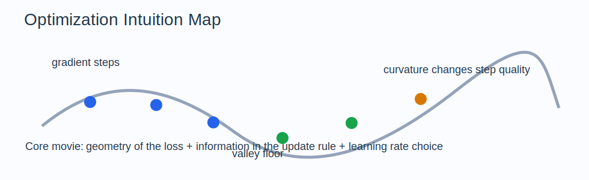

# Optimization Intuition Guide

Optimization is the art of moving parameters to make an objective smaller or larger.
In ML, it is usually "make loss smaller without breaking generalization or stability."

## The Big Idea

Optimization is not just about following the gradient.
It is about the interaction of three things:

- the geometry of the objective
- the information you have about that geometry
- the update rule you choose

Good optimization means these three agree with each other.

## The Mental Model That Makes Everything Click

Picture a traveler moving through a landscape.

- convexity tells you whether there is one clean valley or many traps
- the gradient tells you the local downhill direction
- the learning rate decides how aggressive each step is
- momentum smooths motion
- second-order information adjusts steps using curvature

The traveler only sees locally, so update rules are strategies for acting under limited geometric information.

## How The Notebooks Fit Together

- `01_convexity.ipynb`: when local descent is globally trustworthy
- `02_gradient_descent.ipynb`: the baseline deterministic update
- `03_sgd_and_variants.ipynb`: noisy gradients and momentum-style improvements
- `04_second_order_methods.ipynb`: curvature-aware updates
- `05_constrained_optimization.ipynb`: optimize while obeying rules
- `06_linear_programming.ipynb`: optimization with linear structure
- `07_loss_landscapes.ipynb`: geometry of real objectives
- `08_learning_rate_theory.ipynb`: why step size controls stability and speed

## Intuitionmaxxed Explanations

### Convexity

Convexity is the dream setting.
If the landscape is convex, any local downhill move is aligned with the global problem.

### Gradient Descent

Gradient descent is repeated first-order approximation:

1. locally linearize the objective
2. move against the gradient
3. repeat

It is simple because it trusts only local slope information.

### SGD

SGD uses noisy gradient estimates from mini-batches.
That noise is not only a weakness.
It can help escape brittle sharp regions and makes large-scale training feasible.

### Momentum And Adaptive Methods

Momentum remembers past directions.
Adaptive methods rescale coordinates that behave differently.
Both are attempts to make progress when the landscape is badly shaped.

### Second-Order Methods

Second-order methods ask not just "which way is downhill?" but also "how curved is each direction?"
That matters when one axis is steep and another is flat.

### Constraints

Constraints do not just add difficulty.
They encode the feasible world.
Optimization is only meaningful inside that world.

## Why This Matters In ML

- all learning is optimization of some objective
- training speed depends on conditioning and step-size choice
- regularization often changes the landscape more than the optimizer does
- instability, divergence, and slow learning are usually optimization stories

## Common Traps

- Thinking the gradient always points to fast progress globally.
- Using a learning rate because it "worked before" without checking scale.
- Blaming the optimizer when the objective is badly conditioned.
- Treating noisy training curves as proof something is broken.

## What To Ask Yourself While Studying

- What does the landscape look like near this point?
- Is the problem convex, ill-conditioned, noisy, or constrained?
- What information does the update rule actually use?
- What happens if the learning rate is 10x larger or smaller?
- Is the optimizer fighting the geometry or matching it?
