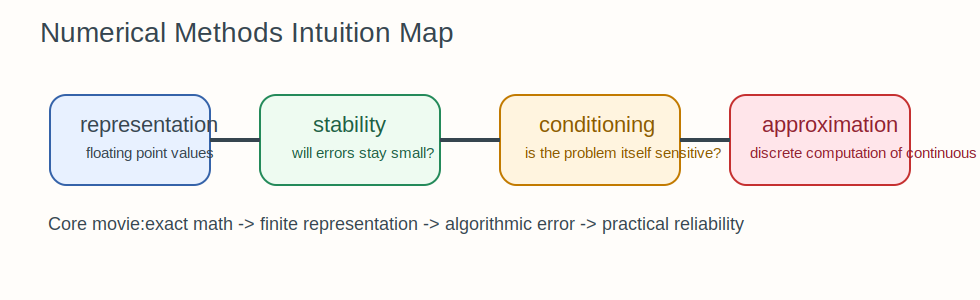

# Numerical Methods Intuition Guide

Numerical methods are about doing mathematics on machines that cannot represent exact real numbers.
This section matters because a mathematically correct formula can still fail computationally.

## The Big Idea

There are always two problems:

1. the mathematical problem you want to solve
2. the computational problem your machine actually solves

Numerical methods are the bridge between those two.

## The Mental Model That Makes Everything Click

Think in layers of approximation:

- real numbers are continuous
- computers store only finitely many representable values
- algorithms transform those approximate values repeatedly
- each transformation can amplify or suppress error

So the real question is never just "is this formula correct?"
It is also "is this computation stable and trustworthy?"

## How The Notebooks Fit Together

- `01_floating_point_arithmetic.ipynb`: how numbers are stored and rounded
- `02_numerical_stability.ipynb`: when algebraically equivalent formulas behave differently on a machine
- `03_numerical_linear_algebra.ipynb`: solving matrix problems without losing reliability
- `04_numerical_integration.ipynb`: approximating continuous quantities using finite samples

## Intuitionmaxxed Explanations

### Floating Point

Floating point is not broken.
It is a compressed representation with limited precision.
The mistake is pretending it behaves like exact arithmetic.

### Stability

An algorithm is stable if small numerical errors stay small.
It is unstable if tiny rounding differences grow into large output errors.

### Conditioning Versus Stability

Conditioning is about the problem itself.
Stability is about the algorithm you use to solve it.

A well-implemented algorithm can still struggle on an ill-conditioned problem.

### Numerical Linear Algebra

Matrix computations are where tiny errors can become very expensive.
That is why decomposition-based methods are often preferred over naive inversion.

### Numerical Integration

Integration rules approximate area by replacing a curve with simpler shapes.
The better the local approximation, the better the integral estimate.

## Why This Matters In ML

- softmax needs stabilization
- loss computations can overflow or underflow
- large matrix operations dominate training and inference
- tiny numerical mistakes can silently change optimization behavior

## Common Traps

- Believing equal algebra means equal numerical behavior.
- Using explicit matrix inversion when a solve or decomposition is safer.
- Ignoring scale until overflow or underflow appears.
- Treating floating-point error as rare instead of inevitable.

## What To Ask Yourself While Studying

- What quantities are being approximated?
- Where can rounding happen?
- Which operations magnify error?
- Is the problem itself sensitive to perturbations?
- What more stable reformulation exists?
