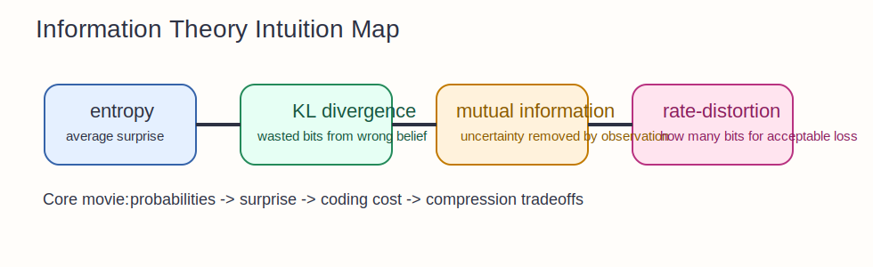

# Information Theory Intuition Guide

Information theory is the mathematics of surprise, compression, and useful dependence.
It asks how much uncertainty exists, how much can be removed, and what price must be paid to store or transmit information.

## The Big Idea

If probability tells you what is likely, information theory tells you how informative an outcome is.

- likely events carry little surprise
- unlikely events carry high surprise
- entropy is average surprise
- mutual information is uncertainty removed by observation
- KL divergence is the cost of using the wrong distribution

This whole section is about turning "how informative is this?" into something measurable.

## The Mental Model That Makes Everything Click

Imagine you are compressing messages from a source.

- if the source is predictable, you can compress aggressively
- if the source is unpredictable, you need more bits
- if two variables share information, observing one reduces uncertainty about the other
- if you encode data using the wrong model, you waste bits

That picture ties almost every notebook together.

## How The Notebooks Fit Together

- `01_entropy_and_information.ipynb`: surprise and average unpredictability
- `02_KL_divergence.ipynb`: mismatch between belief and reality
- `03_mutual_information.ipynb`: shared information between variables
- `04_rate_distortion.ipynb`: the tradeoff between compression and fidelity

## Intuitionmaxxed Explanations

### Entropy

Entropy is not "chaos" in the vague sense.
It is the average number of bits you need if you encode outcomes as efficiently as possible under the true distribution.

### KL Divergence

KL divergence measures how much extra coding cost you pay when your assumed distribution is wrong.
It is not symmetric because "using `q` when the world is `p`" is a different mistake from the reverse.

### Mutual Information

Mutual information is how much knowing one variable shrinks uncertainty about another.
It is zero when variables are independent.
It grows when one variable helps predict the other.

### Rate-Distortion

Perfect compression is not always necessary.
Rate-distortion theory asks how many bits you need when you are allowed to lose some detail in a controlled way.

## Why This Matters In ML

- cross-entropy losses come from coding ideas
- KL terms appear in VAEs, diffusion, and Bayesian objectives
- mutual information helps reason about representation quality
- compression and bottlenecks are central to efficient models

## Common Traps

- Thinking entropy is only about disorder instead of expected coding length.
- Reading KL as a true metric. It is not symmetric and fails the triangle inequality.
- Treating mutual information as simple correlation. It captures nonlinear dependence too.
- Forgetting that compression always depends on a distortion criterion or a coding model.

## What To Ask Yourself While Studying

- What probability model is assumed?
- What uncertainty is being measured?
- What coding or prediction interpretation matches this formula?
- If two variables share information, what uncertainty disappears after observation?
- What tradeoff is being made between fidelity and efficiency?
