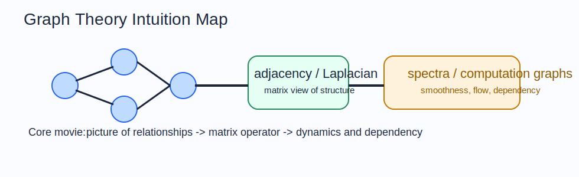

# Graph Theory Intuition Guide

Graph theory is what you use when relationships matter as much as the objects themselves.
In ML, this shows up in knowledge graphs, social networks, computation graphs, message passing, and dependency structure.

## The Big Idea

A graph is a set of entities plus a pattern of connections.
Once you represent a system that way, new questions become natural:

- who is connected to whom?
- how does influence travel?
- what clusters or communities exist?
- which nodes are central?
- how smooth is a signal on the graph?

## The Mental Model That Makes Everything Click

Think in three views of the same object:

1. the picture view: nodes and edges
2. the matrix view: adjacency and Laplacian
3. the dynamics view: walks, diffusion, and message passing

If you can move between those views, graph theory becomes much easier.

## How The Notebooks Fit Together

- `01_graph_basics.ipynb`: the structural language of nodes, edges, degrees, and paths
- `02_spectral_graph_theory.ipynb`: the Laplacian and what its eigenstructure reveals
- `03_computation_graphs.ipynb`: graphs as dependency structure for forward and backward computation

## Intuitionmaxxed Explanations

### Graph Basics

The adjacency matrix is the lookup table for the graph.
It is the bridge from a visual object to something linear algebra can manipulate.

### Spectral Graph Theory

The Laplacian measures disagreement between connected nodes.
If neighboring nodes have very different values, the Laplacian notices.
That is why its eigenvectors reveal smooth patterns, communities, and bottlenecks.

### Computation Graphs

A computation graph is just a graph whose edges mean "this quantity depends on that quantity."
Backpropagation works because gradients can be pushed backward along those dependencies.

## Why This Matters In ML

- GNNs aggregate information across graph neighborhoods
- spectral ideas explain smoothness and graph filtering
- computation graphs are the backbone of autodiff systems
- ranking and recommendation often live on graphs

## Common Traps

- Thinking a graph is only a picture instead of a computational object.
- Forgetting that the same graph can be read combinatorially or spectrally.
- Treating the adjacency matrix as just storage rather than an operator.
- Missing the fact that autodiff itself is graph theory in action.

## What To Ask Yourself While Studying

- What do the nodes represent?
- What does an edge mean in this problem?
- What matrix operator encodes the structure I care about?
- Is this question about connectivity, flow, smoothness, or dependency?
- What information moves along edges, and how?
