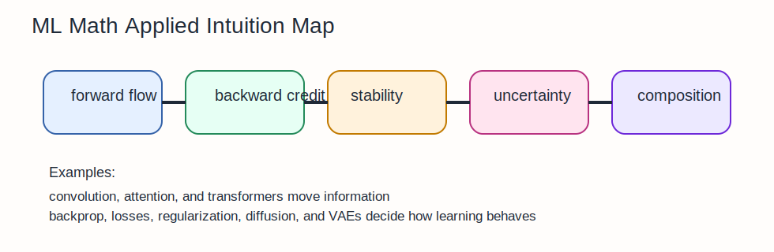

# ML Math Applied Intuition Guide

This section is where the abstract math stops feeling abstract.
It shows how linear algebra, calculus, probability, optimization, and numerical methods fuse into real model components.

## The Big Idea

Most modern ML systems are built from a small set of reusable mathematical moves:

- linear mixing
- nonlinear gating
- normalization
- probabilistic objectives
- structured aggregation
- stochastic corruption and reconstruction

The notebooks in this section are best understood as case studies in those moves.

## The Mental Model That Makes Everything Click

Every model component answers one of these questions:

- how do we move information forward?
- how do we assign credit backward?
- how do we stabilize scale?
- how do we prevent overconfidence or overfitting?
- what probability model are we training?

If you identify which question a component is solving, the formula stops feeling arbitrary.

## How The Notebooks Fit Together

- `01_backpropagation_derived.ipynb`: how credit assignment works
- `02_attention_mechanism.ipynb`: similarity-weighted information routing
- `03_convolutions_as_matmul.ipynb`: local structure as linear algebra
- `04_batch_norm_math.ipynb`: stabilizing feature distributions across a batch
- `05_dropout_math.ipynb`: stochastic regularization
- `06_loss_functions_derived.ipynb`: what the model is actually being asked to optimize
- `07_regularization_math.ipynb`: controlling complexity and scale
- `08_transformer_math_complete.ipynb`: composing attention, residuals, and normalization
- `09_diffusion_models_math.ipynb`: denoise after gradual corruption
- `10_VAE_math.ipynb`: latent-variable learning with reconstruction plus KL control

## Intuitionmaxxed Explanations

### Backpropagation

Backprop is the chain rule with bookkeeping.
Each layer contributes a local sensitivity term.
Training works because those local terms can be chained backward efficiently.

### Attention

Attention is soft routing.
Instead of choosing one source token, it distributes focus across many and takes a weighted average.

### Convolution

Convolution says "look at the same local pattern detector everywhere."
That is weight sharing turned into geometry.

### Normalization And Dropout

Normalization stabilizes scale.
Dropout injects uncertainty so the network does not over-rely on any one feature path.

### Transformers, Diffusion, VAEs

These models look very different on the surface, but underneath they reuse the same mathematics:

- linear maps and projections
- nonlinear activations
- probability distributions
- optimization over differentiable objectives

## Why This Matters In ML

This section is the bridge from math literacy to model literacy.
If you can explain these notebooks cleanly, you can usually read modern architecture papers without getting lost in notation.

## Common Traps

- Treating architectures as collections of tricks instead of mathematical design choices.
- Memorizing formulas without asking what failure mode the component is fixing.
- Thinking "advanced model" means "new math." Usually it means a new composition of familiar math.

## What To Ask Yourself While Studying

- What information is flowing forward?
- What signal is flowing backward?
- What is being normalized, regularized, or reweighted?
- What probability model is hidden inside the loss?
- Which earlier sections explain this component?
