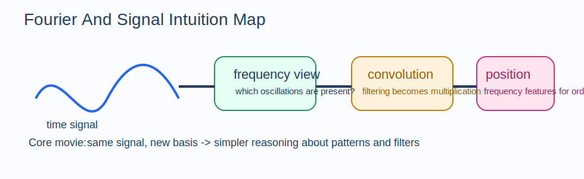

# Fourier And Signal Intuition Guide

Fourier methods are about changing your point of view.
A signal that looks complicated in time can look simple in frequency.

## The Big Idea

Instead of asking "what is the signal value right now?", Fourier thinking asks:

"Which oscillations are present, and with what strength?"

That one shift in viewpoint explains the whole section.

## The Mental Model That Makes Everything Click

Imagine sound.
You can hear a chord as one object, or you can decompose it into notes.
Fourier analysis does the same thing mathematically:

- the time domain shows how the signal evolves
- the frequency domain shows which oscillatory components are present
- convolution becomes multiplication in frequency space

This is powerful because multiplication is often much easier to reason about than repeated local mixing.

## How The Notebooks Fit Together

- `01_fourier_series.ipynb`: periodic signals as sums of sinusoids
- `02_fourier_transform.ipynb`: the continuous-frequency generalization
- `03_convolution_theorem.ipynb`: filtering becomes multiplication in frequency space
- `04_positional_encodings.ipynb`: frequency features used to represent order

## Intuitionmaxxed Explanations

### Fourier Series

For periodic signals, sine and cosine waves act like a basis.
Complex patterns become weighted sums of simple oscillations.

### Fourier Transform

The Fourier transform generalizes that same idea beyond simple periodic repetition.
It asks how much of each frequency is present in the signal.

### Convolution Theorem

Convolution in time means "mix local neighborhoods."
In frequency space, the same operation becomes multiplication, which is why filtering is easier to analyze there.

### Positional Encodings

Sinusoidal positional encodings give models a frequency-based coordinate system for order.
Different frequencies capture different scales of positional change.

## Why This Matters In ML

- CNNs and signal processing rely on convolutional reasoning
- spectral structure appears in audio, vision, and time-series models
- positional encodings give transformers access to order information
- diffusion and generative modeling often use frequency-space intuitions too

## Common Traps

- Treating the frequency domain as a different signal instead of a different description of the same signal.
- Forgetting that sharp local changes require many frequencies.
- Memorizing the convolution theorem without understanding why it simplifies filtering.
- Seeing positional encodings as arbitrary magic instead of structured Fourier features.

## What To Ask Yourself While Studying

- Is this signal easier to understand in time or frequency?
- Which frequencies dominate?
- What operation becomes simpler after the transform?
- What basis is being used to represent the signal?
- How does this spectral view help a model reason about structure?
