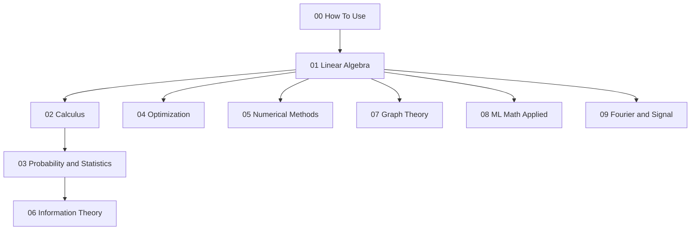

# Mathematics for Machine Learning

[](https://github.com/AKMessi/math-for-ML/actions/workflows/ci.yml)
[](./LICENSE)
[](./CONTRIBUTING.md)

A beginner-to-advanced open-source curriculum for the mathematics that underlies modern machine learning.

Repository: https://github.com/AKMessi/math-for-ML

This repository is designed for:
- Complete beginners who need intuition before notation
- Practitioners who want to replace memorized formulas with derivations
- Advanced engineers who want tested reference implementations
- Researchers who need a compact, reusable math companion

## Learning Path



## Tracks

| Track | Audience | Time |
| --- | --- | --- |
| Beginner | No ML background | 8 weeks |
| Practitioner | Knows ML, wants rigor | 4 weeks |
| Researcher | Needs deeper theory | 6 weeks |
| Quick Reference | Needs formulas fast | Instant |

## Prerequisites

| Need | Start here |
| --- | --- |
| Algebra | [prerequisites.md](./00_how_to_use/prerequisites.md) |
| Python basics | [prerequisites.md](./00_how_to_use/prerequisites.md) |
| Study plan | [learning_paths.md](./00_how_to_use/learning_paths.md) |

## One-Command Setup

```bash
python -m pip install -r requirements.txt && python -m pip install -e .
```

Run the test suite with:

```bash
python -m pytest
```

Run notebook execution checks with:

```bash
python scripts/run_notebooks.py
```

## Sections

Each section now includes an `intuition_guide.md` with high-level explanations and visuals before the notebook deep dive.

| Section | Scope |
| --- | --- |
| [Linear Algebra](./01_linear_algebra/README.md) | 7 notebooks |
| [Calculus](./02_calculus/README.md) | 9 notebooks |
| [Probability and Statistics](./03_probability_and_statistics/README.md) | 10 notebooks |
| [Optimization](./04_optimization/README.md) | 8 notebooks |
| [Numerical Methods](./05_numerical_methods/README.md) | 4 notebooks |
| [Information Theory](./06_information_theory/README.md) | 4 notebooks |
| [Graph Theory](./07_graph_theory/README.md) | 3 notebooks |
| [ML Math Applied](./08_ml_math_applied/README.md) | 10 notebooks |
| [Fourier and Signal](./09_fourier_and_signal/README.md) | 4 notebooks |

## Contributing

See [CONTRIBUTING.md](./CONTRIBUTING.md).

## Citation

```bibtex
@misc{math_for_ml_repo,
  title = {Mathematics for Machine Learning},
  author = {Open Source Contributors},
  year = {2026},
  howpublished = {GitHub repository},
  url = {https://github.com/AKMessi/math-for-ML}
}
```

## License

MIT. See [LICENSE](./LICENSE).
